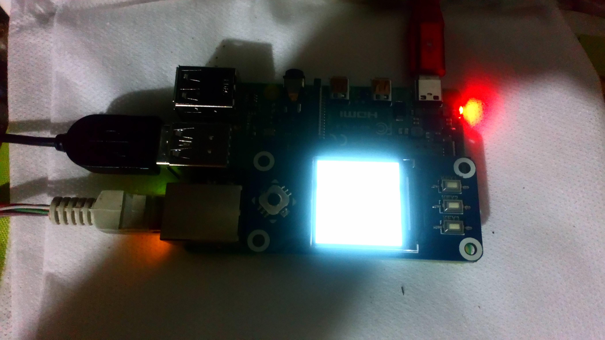
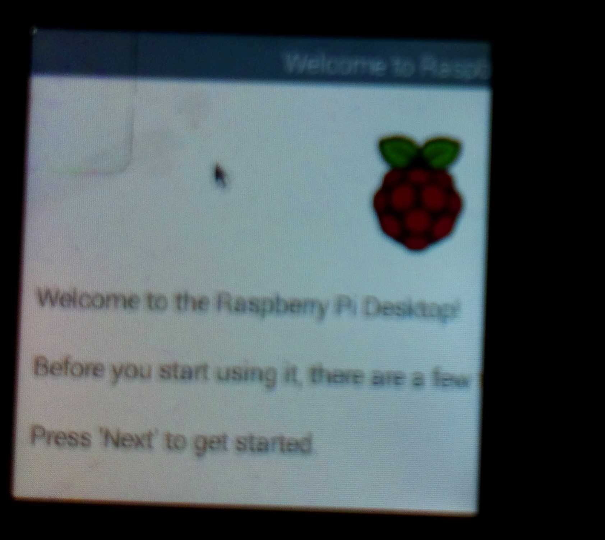
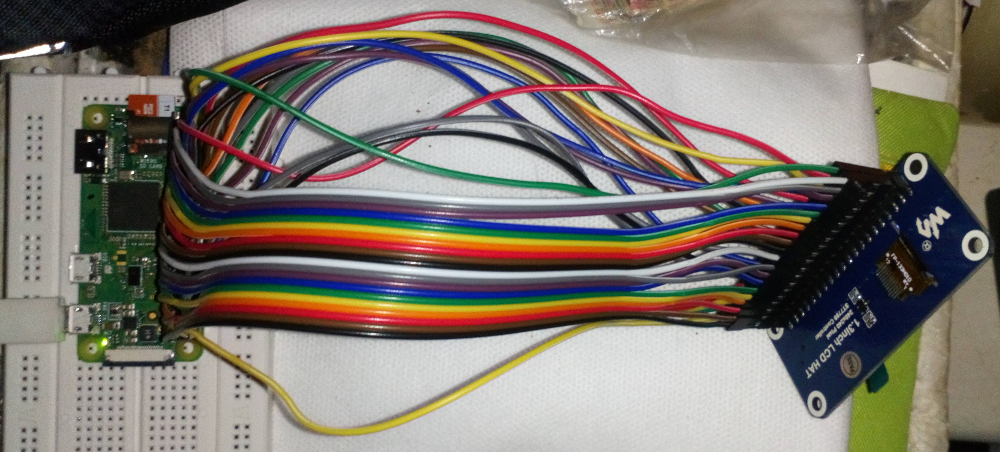
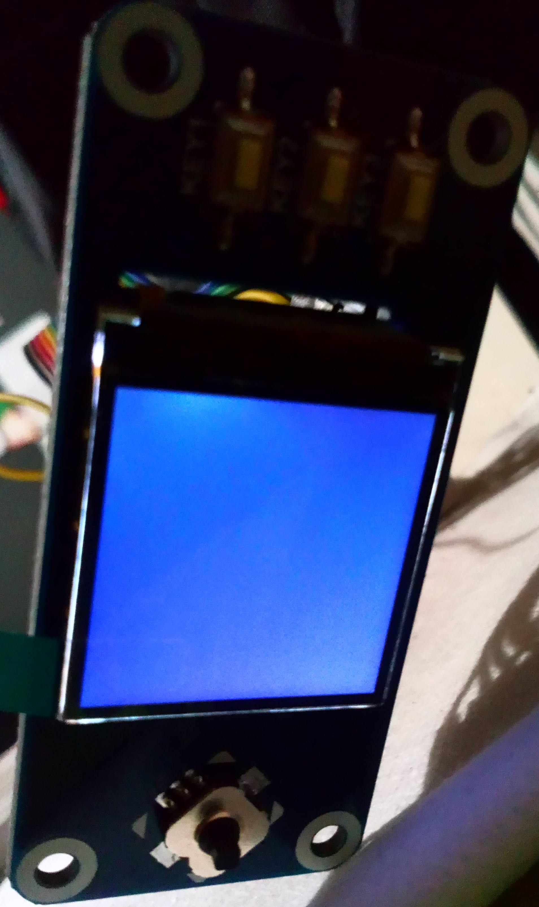

# 1.3 inch LCD HAT

This is an IPS LCD display HAT drivers and instructions for Raspberry Pi, 1.3inch diagonal, 
240x240 pixels, with embedded controller, communicating via SPI interface.

This repo is using the [WaveShare tutorial](https://www.waveshare.com/wiki/1.3inch_LCD_HAT).


## Tested devices

### Raspberry Pi 4

It works perfectly fine on the raspberry pi 4 model B.




by the way sorry for the low quality of the last picture.

### ⚠ Raspberry Pi Zero W

**It's not working yet** on the raspberry pi Zero W.





## ⚙ How to build it?


- Open terminal, use command to enter the configuration page

    ```
    sudo raspi-config
    Choose Interfacing Options -> SPI -> Yes  to enable SPI interface
    ```
- Reboot Raspberry Pi：

    `sudo reboot`

Please make sure that SPI interface was not used by other devices, you can check in the `/boot/config.txt`.

## Install Libraries

- Install BCM2835 libraries

    ```
    wget http://www.airspayce.com/mikem/bcm2835/bcm2835-1.68.tar.gz
    tar zxvf bcm2835-1.68.tar.gz 
    cd bcm2835-1.68/
    sudo ./configure && sudo make && sudo make check && sudo make install
    ```

For more details, please refer to http://www.airspayce.com/mikem/bcm2835/.

- Install Python libraries

    ``` 
    sudo apt-get update -y
    sudo apt-get install ttf-wqy-zenhei -y
    sudo apt-get install python-pip -y
    sudo pip install RPi.GPIO
    sudo pip install spidev
    ```

### Use the Examples

Open Raspberry Pi terminal, go to where is located the repository folder and run the following commands:

```
sudo chmod 777 -R 1.3-inch-LCD-HAT
cd 1.3-inch-LCD-HAT
```
    
### ▶ Run the demo

- **`C`**

    ``` 
    cd c
    make clean
    make
    sudo ./main
    ```

- For Raspberry Pi 4B and system version after raspbian_lite-2019-06-20, please set as following for normal input:

    `sudo nano /boot/config.txt`

And then add the following line at the end of the config.txt

`gpio=6,19,5,26,13,21,20,16=pu`


- **`python`**

```
    cd python
    sudo python main.py
    sudo python key_demo.py
```

## FBCP Transplant

The Framebuffer uses a memory area to store the display content, and changes the data in the memory to change the display content.

There is an open-source project on github: `fbcp-ili9341`. Compared with other fbcp projects, this project uses partial refresh and DMA to achieve a refresh rate of up to 60fps.

### Compile and Run

Go inside where is located the repository and use these commands:

```    
    sudo apt-get install cmake -y
    cd FBCPTransplant/Fbcp-ili9341
    cmake -S . -B build/ -DSPI_BUS_CLOCK_DIVISOR=20 -DWAVESHARE_ST7789VW_HAT=ON -DDMA_TX_CHANNEL=10 -DDMA_RX_CHANNEL=1 -DBACKLIGHT_CONTROL=ON -DSTATISTICS=0
    cd build
    make -j
    sudo ./fbcp-ili9341
```

### Auto-start when Power on

```
sudo cp ~/Fbcp-ili9341/build/fbcp-ili9341 /usr/local/bin/fbcp
sudo nano /etc/rc.local
```

And then add `fbcp&` before `exit 0`.

### Set the display resolution

Set the user interface display size in the /boot/config.txt file.

```
sudo nano /boot/config.txt
```

Then add the following lines at the end of the config.txt.

```
hdmi_force_hotplug=1
hdmi_cvt=300 300 60 1 0 0 0
hdmi_group=2
hdmi_mode=1
hdmi_mode=87
display_rotate=0
```

**Note:** If you are using Raspberry Pi 4B, you need to comment out the following lines on the [pi4] part. The modification is as below:

```
[pi4]
# Enable DRM VC4 V3D driver on top of the dispmanx display stack
#dtoverlay=vc4-fkms-v3d
#max_framebuffers=2
```

And then reboot the system

```
sudo reboot
```

The final display effect is scaled and displayed on the 1.3inch LCD in proportion. The setting of the resolution here should be slightly larger than the LCD resolution, the too high resolution will cause the font display to be blurred.

After rebooting the system, the Raspberry Pi OS user interface will be displayed.